
## 区域信息
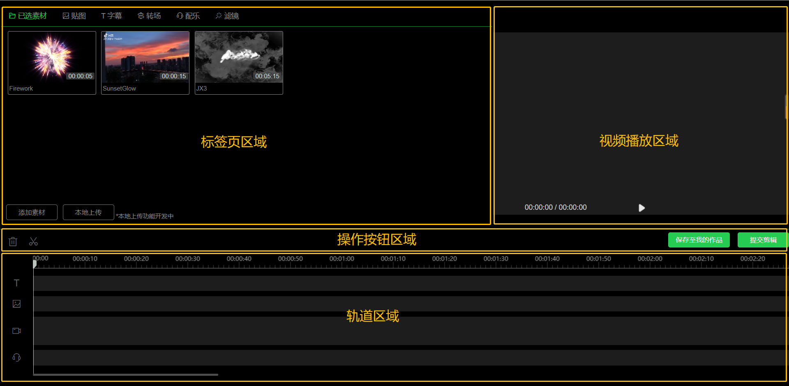

## 标签页区域

### 素材标签页

#### 已选素材
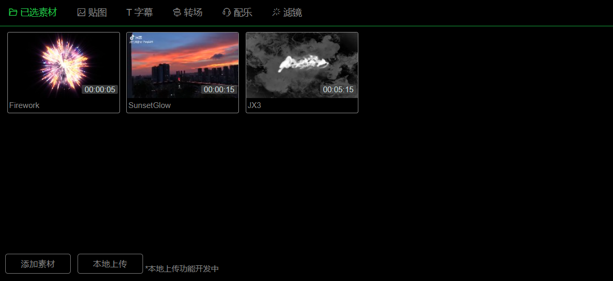

<b>已选素材标签页</b> 用于展示已有的可用视频素材。

- <b>鼠标悬停于素材</b>时，删除功能图标

 与 添加(素材到轨道)功能图标

  分别显示于左右上角。

- <b>添加素材</b> 可通过 添加素材按钮 或 本地上传按钮 实现。
	- 点击
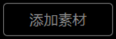
添加素材，显示弹窗，内包含所有在线素材，以供添加。
	- 点击
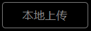
可选择本地视频，仅支持上传<b>mp4</b>格式视频，<b>单次单个</b>上传。
- <b>添加已选素材到轨道</b> 可通过 功能图标

 或 鼠标拖拽 实现。
	- 点击素材右上角的

，所选素材自动添加至当前视频轨道的<b>末尾</b>。
	- 鼠标拖拽至 视频轨道，可选择位置进行放置。
	- 长度为<b>素材长度</b>。
- <b>删除已选素材</b> 可通过 功能图标

 实现。
	- 点击素材左上角的

，即可进行删除操作。
  - 若所选素材 已在视频轨道中使用，不允许删除。

#### 贴图
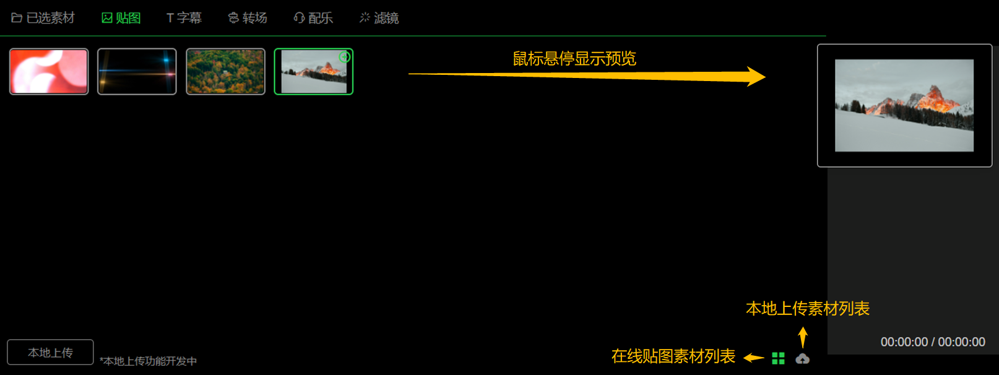

<b>贴图标签页</b> 用于展示可选用的贴图素材。

- <b>鼠标悬停于素材时：</b>
  - 添加(贴图到轨道) 功能图标

显示于右上角。
  - 若为本地贴图，还有删除 功能图标

显示于左上角。
  - 贴图预览显示于<b>列表右侧</b>，若为视频贴图，显示为循环播放。

- <b>切换贴图列表</b> 可通过右下角图标，实现 在线贴图

 与 本地贴图

 的切换。
- <b>本地贴图</b> 通过

实现，仅支持上传<b>png</b>格式静态图片，<b>单次单个</b>上传。
- <b>添加贴图到轨道</b> 可通过 功能图标

 或 鼠标拖拽 实现。
  - 点击素材右上角的

，所选贴图自动添加至 贴图轨道。添加位置为<b>指针处</b>，若当前指针处 已有贴图，则 紧贴指针处贴图 向后添加。
  - 鼠标拖拽至 贴图轨道，可选择位置进行放置。
  - 长度：<b>视频贴图</b>为<b>视频长度</b>，<b>静态贴图</b>默认<b>10s</b>。
- <b>删除本地贴图</b> 可通过左上角的

，即可进行删除。

#### 字幕
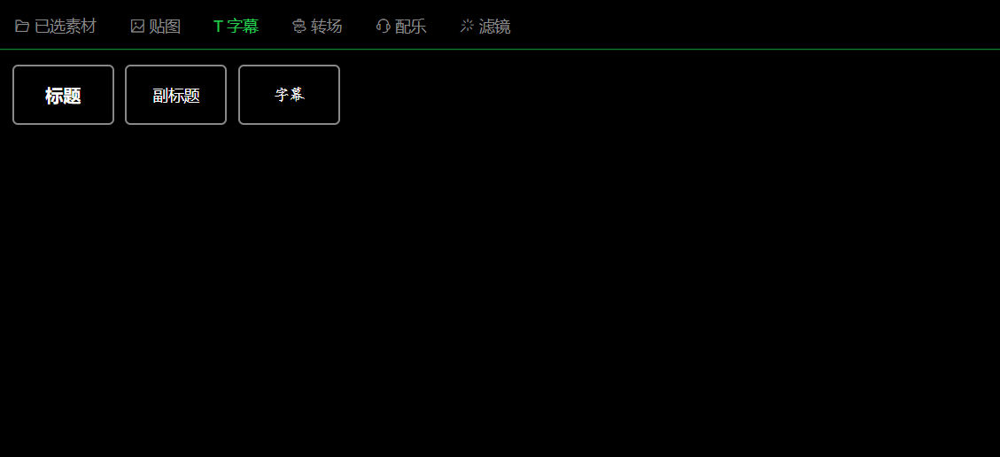

<b>字幕标签页</b> 用于展示可选用的字幕样式素材。

- <b>鼠标悬停于素材</b>时，添加(字幕到轨道) 功能图标

显示于右上角。

- <b>添加贴图到轨道</b> 可通过 功能图标

 或 鼠标拖拽 实现。
  - 点击素材右上角的

，所选字幕自动添加至 字幕轨道。添加位置为<b>第一条字幕轨道的指针处</b>，若当前指针处 已有字幕，则 紧贴指针处字幕 向后添加。
  - 鼠标拖拽至 字幕轨道，可选择位置进行放置。
  - 长度默认<b>10s</b>。

#### 其他标签页

转场、配乐、滤镜功能开发中。

### 操作标签页

#### 贴图
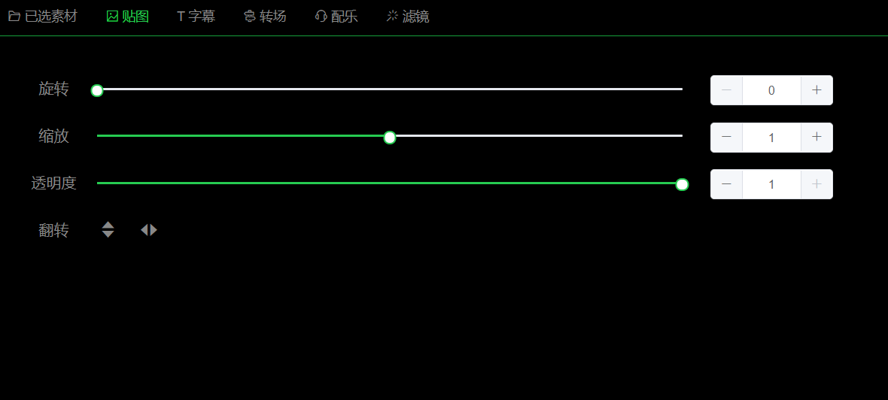
- <b>旋转：</b>控制DRR的旋转度数，与handler的旋转操作同步数值。数值[0, 360]，默认0，滑块步长为1。
- <b>缩放：</b>控制DRR的显示大小，以当前数值所对应的DRR宽高进行比例缩放。数值[0, 2]，默认1，滑块步长为0.01。
- <b>透明度：</b>控制DRR的透明度显示。数值[0, 1]（0为全透明 1为不透明），默认1，滑块步长为0.1。
- <b>翻转：</b>可选 垂直翻转 或 水平翻转，两种翻转效果<b>互斥</b>。

#### 字幕
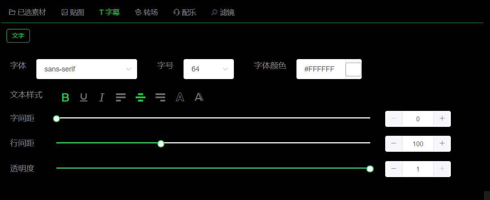

- <b>文本样式 - 加粗

：</b>设置DRR的font-weight为600。若DRR所设字体有加粗属性，则此设置<b>无效果</b>。
- <b>文本样式 - 描边

：</b>给DRR内字幕添加 宽度为1px 的 黑色描边。
- <b>文本样式 - 阴影

：</b>给DRR内字幕添加 Y轴方向 偏移1.5px 的 黑色阴影。
- <b>字间距：</b>数值[0, 300]，默认0，滑块步长为1。
- <b>行间距：</b>数值[0, 300]，默认100，滑块步长为100。此属性只可取 0/100/200/300 为值。
- <b>透明度：</b>数值[0, 1]（0为全透明 1为不透明），默认1，滑块步长为0.1。

## 视频播放区域
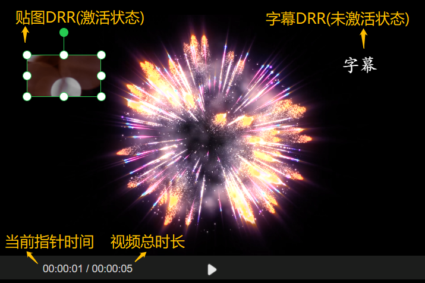

### 视频画面

<b>视频画面部分</b> 用于显示 指针所处 的 视频帧画面(视频轨道)。

- 时间区域显示内容为：当前指针所处时间 / 视频轨道总时长。
- 播放/暂停：通过功能图标 或 空格键 实现。

### 可操作DRR

Draggable-Resizable-Rotatable的可操作对象简称。

- 点击可<b>激活</b>对应handler、操作标签页 以及 对应的轨道块。
- 通过handler可进行对应方向 <b>缩放</b> 与 <b>旋转</b>。
- 支持<b>等比缩放：</b>键盘摁Shift的同时拖拽handler。

#### 贴图DRR
层级于字幕DRR之下。默认宽度100px，高度与原大小成比例。

#### 字幕DRR
层级最高。若存在多字幕轨时，层级对应 轨道顺序 从下到上 依次升高。默认宽度100px，高度70px。

## 操作按钮区域
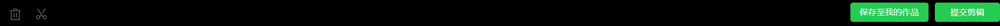

<b>删除按钮：</b>支持 所有轨道块 进行删除及连续删除。

<b>裁剪按钮：</b>仅支持 视频轨道块 进行裁剪。

<b>保存至我的作品/提交剪辑：</b>打开剪辑的整体预览 及 相关字段设置的弹窗。

## 轨道区域
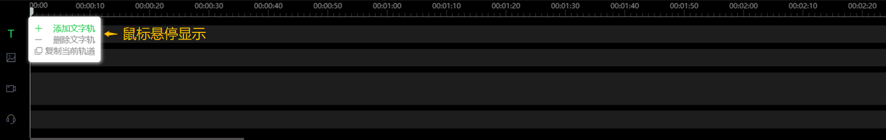

轨道 从上到下 依次为：字幕、贴图、视频、音频(待开发)。

### 指针

- 指针<b>移动方式</b>为：
  - 鼠标 拖拽指针。
  - 时间轴区域内 点击 或 拖拽。
  - 字幕轨道块 / 贴图轨道块 点击时，自动跳转至 所选轨道块<b>中间</b>。
  - 所能移动的范围为 [0, 视频轨内最远轨道块的的结束点]。

### 时间轴

- 初始时间长度设置为<b>10min</b>。
- 区域内支持 点击带动指针 跳转及移动。

### 字幕轨

- <b>支持多轨</b>
  - 鼠标悬停轨道图标 即可显示多轨操作块，可选择<b>添加、删除、复制</b>轨道。
  - <b>轨道条数</b>控制范围为[1, 5]。
- 轨道块<b>支持选中后调整长度</b>：
  - 鼠标悬停至 所选块右边框处，鼠标形状变为 <b>可伸缩图标</b> 时即可操作。
  - 调整范围为[5, 轨道长度]，单位为px。

### 贴图轨

- 轨道内可包含 <b>视频贴图</b> 与 <b>图片贴图</b>。
- 轨道块<b>支持选中后调整长度</b>：
  - 鼠标悬停至所选块右边框处，鼠标形状变为 <b>可伸缩图标</b> 时即可操作。
  - <b>视频贴图</b>轨道块 调整范围为[5, 视频本身长度]，单位为px。
  - <b>图片贴图</b>轨道块 调整范围为[5, 轨道长度]，单位为px。

### 视频轨

- 轨道内<b>最远轨道块</b>的<b>结束时间</b>决定产出视频的<b>总时长</b>。

## 按键支持

<b>空格(space)：</b>视频区域的播放/暂停。

<b>删除(delete) / 回退(backspace)：</b>所选轨道块的删除。

<b>上档(shift)：</b>结合DRR handler实现DRR比例缩放。